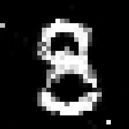
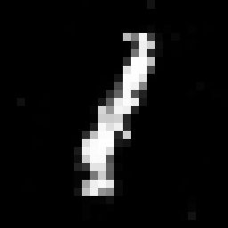

# PyTorch GANs 💻 

This repo contains PyTorch implementation of Vanilla GAN architecture. ` `

## Appendix

* [Interpreting GANs](#interpreting-gans)
* [Virtuo GAN](#virtuo-gan)

---

## Interpreting GANs

Generative Adversarial Networks, or GANs, are a subset of deep learning models that combine a discriminator with a generator network. The discriminator network learns to separate the fake data from the genuine data while the generator network learns to produce realistic-looking fake data (e.g., pictures, audio, and text) from random noise. The generator tries to trick the discriminator by producing increasingly convincing false data, while the discriminator strives to accurately distinguish between the actual and fake data. The two networks are trained concurrently in an adversarial fashion.

The original paper introducing GANs is titled [Generative Adversarial Networks](https://papers.nips.cc/paper/5423-generative-adversarial-nets.pdf) and was authored by Ian Goodfellow, Jean Pouget-Abadie, Mehdi Mirza, Bing Xu, David Warde-Farley, Sherjil Ozair, Aaron Courville, and Yoshua Bengio. It was published in 2014 at the Conference on Neural Information Processing Systems (NIPS).

GANs have two components:

1. `<b>`Generator Network:`</b>` The generator network takes a random noise vector as input and generates a new image.
2. `<b>`Discriminator Network:`</b>` The discriminator network takes an image as input and outputs a scalar value indicating whether the image is real or fake.

---

## Virtuo GAN

Virtuo GAN is my implementation of the original GAN paper, modified to use LeakyReLU and 1D batch normalisation, among other model architecture-related changes.

### Examples

GAN was trained on data from MNIST dataset. Here is how the generated digits look like:

    
    

---

## Acknowledgements

I've used the following repositories as reference for implementing my version:

* [pytorch-GANs](https://github.com/gordicaleksa/pytorch-GANs) (PyTorch)
* [research_implementations](https://github.com/ahmadchalhoub/research_implementations) (PyTorch)

[def]: #virtuo-gan